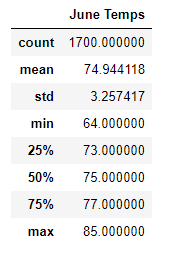
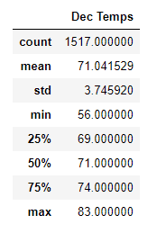

# Surfs up

**Disclaimer:**
*This analysis was prepared for the express use of W. Avey for the opening of a Surf Shop in Hawaii.  Unintended use of or by anyone else is expressly forbidden under the terms of the NDA executed on Feb 4, 2021.*

## Overview:
This paper covers the analysis of weather data for the state of Hawaii over the course of a year with a focus on 2 months of data, June and December.     It seeks to draw conclusions from this weather data toward the probability that a surf shop in Hawaii would be successful.  It is the researcher’s solid opinion that there are so many other factors need to be analyzed for the success of this surf shop that taking money for this analysis is akin to robbery.  In addition, W. Avey must be smoking something to even think like this.

### Caveat
The idea that air temperature would be any kind of primary indicator for the success of shop that offers multiple lines of services that are not impacted by the weather is an indicator that W. Avey may not actually be serious about this shop.  This researcher will look to get paid up front for any additional research requested in light of this fact.

## Results:
Initial results in the comparison of June and December air temperature in Hawaii show some well known facts about Hawaii:

- June temperatures average 75F with a std deviation of 3.25 degrees F.

- Dec temperatures average 71F with a std deviation of 3.74 degrees F.

- Since these 2 months are essentially at the solstices we can safely draw the conclusion that  average air temps don’t change very much in Hawaii.

## Summary:
As discussed in the opening of this review, weather data is not a critical issue to the success or failure of a surf shop in Hawaii.  However, additional weather data that might be factored in would include precipitation and wind speed.   Both of those factors would impact the ability to go surfing.   In addition, it would be important to narrow the data taken from the closest station to the actual location of the surf shop and the place customers would go surfing.  

In reviewing the dataset, Precipitation data was available but not much else.   Wind speed and cloudiness (an indicator of wind speed and precipitation and other weather factors) were not included in the data set.   

The incompleteness of the data set with these additional factors is another reason why any research for this customer should be on a cash up front basis, as W. Avey obviously doesn’t understand successful business paradigms.

